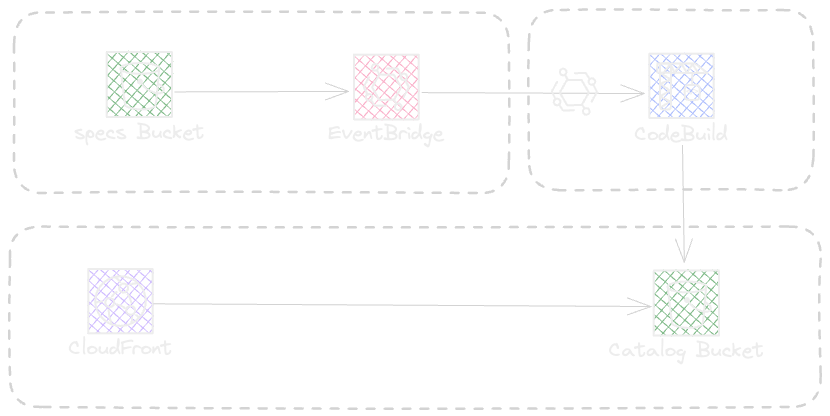
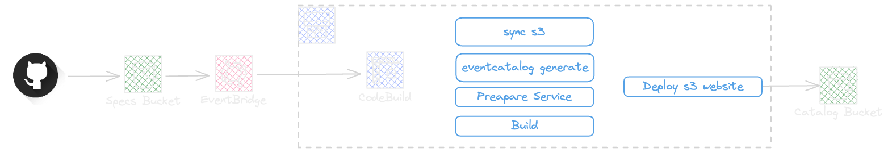
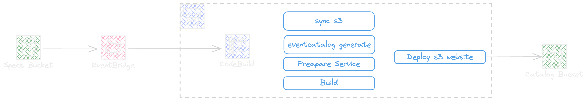

# Event catalog automated sync and deploy

This is an example of EventCatalog to document the event-driven architecture in an automated way.

Event catalog: https://www.eventcatalog.dev/

## Catalog stack



## Catalog Pipeline



### Catalog Sync



## Deploy

Deploying the Catalog stack will be done by deploying first the Catalog stack followed by the Catalog Pipeline stack.

```shell
npm run cdk:catalog:dev deploy --prefix cdk -- --all --require-approval never
```


> The repository has a github action to sync the specification in `specs` folder for any service ( this let simulate how to synchronize specs from many repositories into the spec s3 bucket), the github action needs the AWS credentials to be setup for the repository or organization, you can use an idp but for this example we need to add two secrets for the repository, AWS_ACCESS_KEY_ID and AWS_SECRET_ACCESS_KEY

## Catalog generation

The [config generator](./catalog/config.generator.js) will generate the `eventcatalog.config.js` file from all `yaml` specifications in `specs` folder.

In Catalog Pipeline the specs folder will be synced from `s3` specs bucket and the `eventcatalog.config.js` will be generated next using the `npm run prepare` command. In the next step the `npm run generate` will generate the domains from specifications in `specs` folder.

At the end of build process the `npm run build` will generate the optimized bundle and the deploy step will sync the bundle in catalog website s3 bucket.

## Access to catalog

The catalog in this example is a public website, interfaced by a Cloudfront CDN.

To restrict access add a `WebACL` with your internal IP range being VPN or other ranges per your enterprise network strategy.
